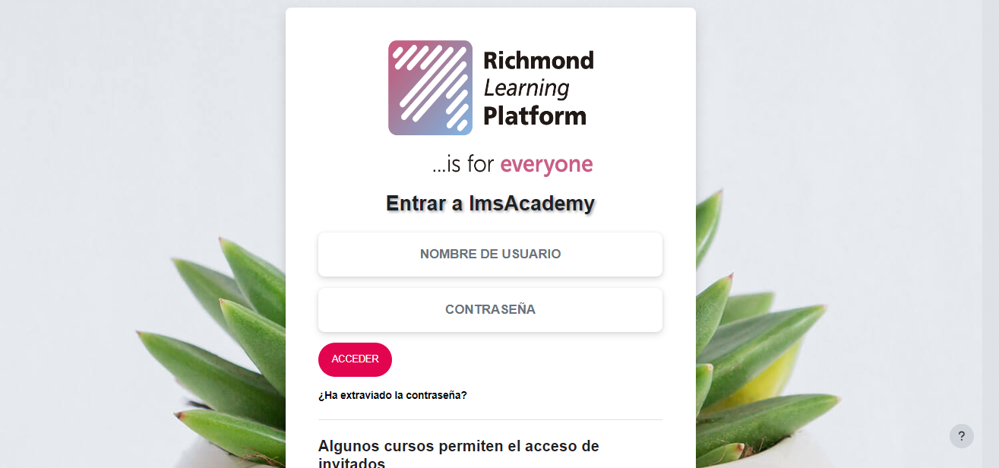
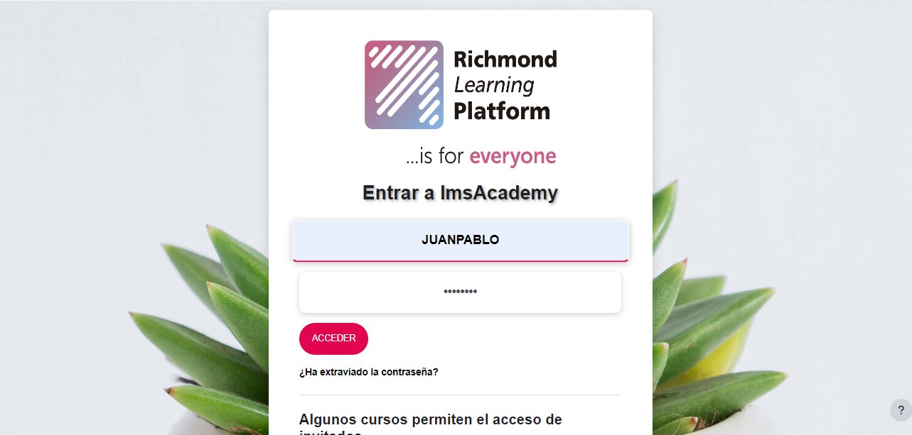
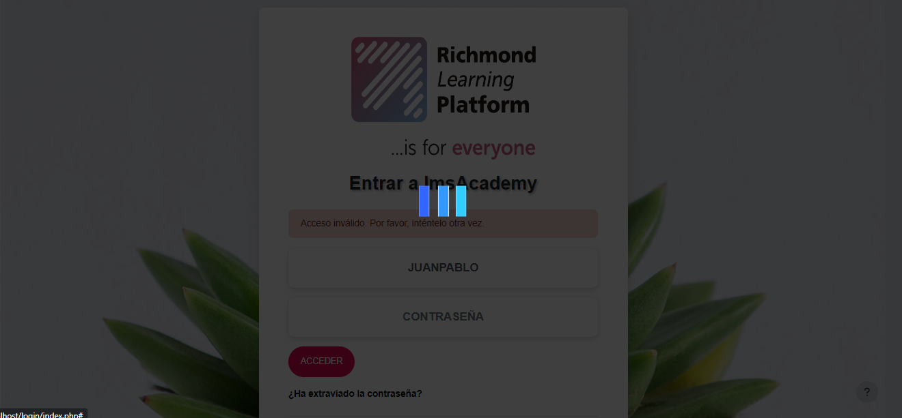
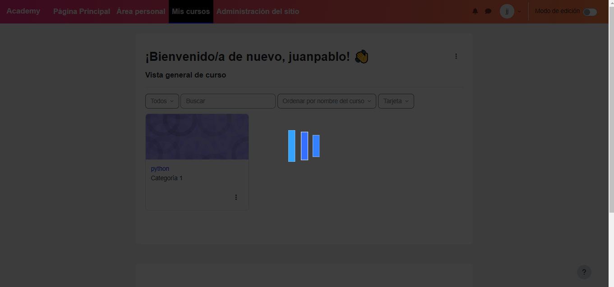

# Tema Moodle "Animated"

El Tema Moodle "Animated" es un tema secundario de Boost, diseñado para agregar la capacidad de cargar fondos animados en tu sitio Moodle. Este tema proporciona una interfaz visualmente atractiva y personalizable para tu plataforma Moodle.

## Características

- Soporte para fondos animados.
- Esquemas de colores personalizables.
- Integración con las características principales de Moodle.

## Instalación

1. Descarga los archivos del tema.
2. Extrae la carpeta del tema en el directorio `theme/` de tu instalación de Moodle.
3. Inicia sesión en tu sitio Moodle como administrador.
4. Ve a **Administración del sitio > Apariencia > Temas > Selector de temas**.
5. Selecciona "Animated" como el tema activo de tu sitio.

## Configuración

### Configuración General

- **Color de Marca**: Puedes personalizar el color de acento del tema para que coincida con la identidad de tu institución.

### Presets del Tema

El tema ofrece varios archivos de configuración preestablecidos que pueden cambiar significativamente la apariencia del sitio. Estos presets te permiten elegir diferentes estilos visuales para tu sitio. Puedes crear tus propios presets o explorar los presets compartidos por otros en el [repositorio de Presets](http://moodle.net/boost).

### CSS Personalizado

Puedes personalizar aún más la apariencia del tema agregando tu propio código CSS o SCSS en las configuraciones "Raw SCSS" y "Raw initial SCSS". Esto te permite realizar cambios de diseño específicos más allá de las opciones preestablecidas.

## Uso

Una vez que hayas instalado y configurado el Tema Moodle "Animated", puedes comenzar a personalizarlo para que se adapte a las necesidades de tu institución. Aquí tienes algunas opciones de personalización:

- **Animación de Fondo**: Carga imágenes de fondo animadas para crear una experiencia visual atractiva para tus usuarios.
- **Esquema de Colores**: Ajusta el color de marca para que coincida con la imagen de tu organización.
- **CSS Personalizado**: Utiliza las configuraciones "Raw SCSS" y "Raw initial SCSS" para agregar código CSS o SCSS personalizado y adaptar la apariencia del tema.

## Ejemplos-login

## ejemplos-interfaz

## Contribuciones

Si tienes sugerencias, informes de errores o deseas contribuir al desarrollo de este tema, visita el [repositorio de GitHub](https://github.com/tu-enlace-repo) para obtener más información.

## Licencia

Este tema se distribuye bajo la Licencia Pública General de GNU (GPL). Consulta el archivo [LICENSE](LICENSE) para obtener más detalles.

## Soporte

Si encuentras algún problema o necesitas ayuda con este tema, por favor [contáctanos](mailto:soporte@ejemplo.com).

¡Disfruta usando el Tema Moodle "Animated"!
